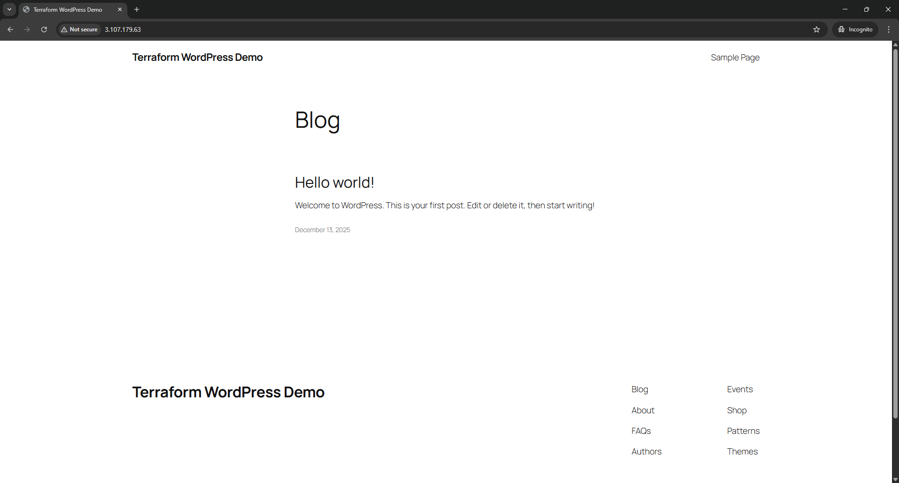

# WordPress Deployment with Terraform using AWS

Provision a complete WordPress stack on AWS using Terraform end-to-end, including networking, security groups, EC2, and automated bootstrapping.

## Project Structure

```
terraform-wordpress/
├── infra/
|   ├── backend.tf              # Remote state configuration (S3 + state locking)
|   ├── providers.tf            # AWS provider configuration
|   ├── main.tf                 # Core infrastructure resources
|   ├── variables.tf            # Input variables
|   └── outputs.tf              # Useful outputs (public IP, URL)
└── scripts/
    └── install_wordpress.sh    # EC2 bootstrap script
```

## How It Works

1. Terraform provisions AWS resources (VPC, subnets, IGW)
2. An EC2 Instance is created using the latest Ubuntu AMI (dynamically via data sources)
3. A user data (cloud init) script runs on boot to:
   - Install Apache, MySQL, WordPress and PHP
   - Create a WordPress database and user
   - Set WordPress as root (replace index.html)
4. Apache is restarted and WordPress is accessible via public IP through HTTP

## Requirements

- AWS CLI
- IAM least privileges applied to your AWS user
- Terraform installed locally
- Create S3 bucket for remote backend on AWS console

## How to Deploy

### 1. Clone the Repo

```bash
git clone https://github.com/shaqealjinnah/terraform-wordpress.git
cd infra
```

### 2. Initalise Terraform

```bash
terraform init
```

### 3. Review & Apply Infrastructure

```bash
terraform plan
terraform apply
```

### 4. Check the Live Site
After the deployment, you should see an output like:
```bash
wordpress_url = "http://16.xx.xx.xx"
```

## Live WordPress Deployment



The screenshot above shows the successfully deployed WordPress site running on an EC2 Instance provisioned entirely with Terraform.

## Future Improvements

- Modularise Terraform configuration
- Replace MySQL to RDS in private subnet
- Add HTTPS using ALB + ACM
- Add CI pipeline for Terraform formatting and validation

